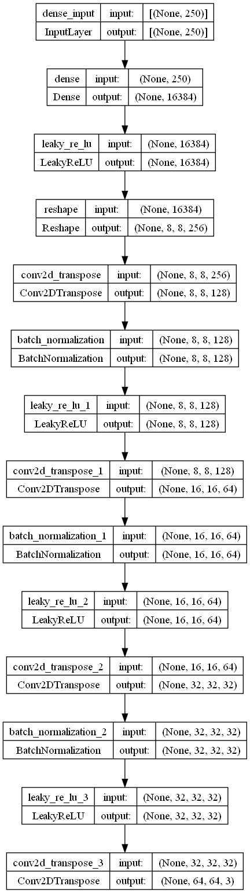
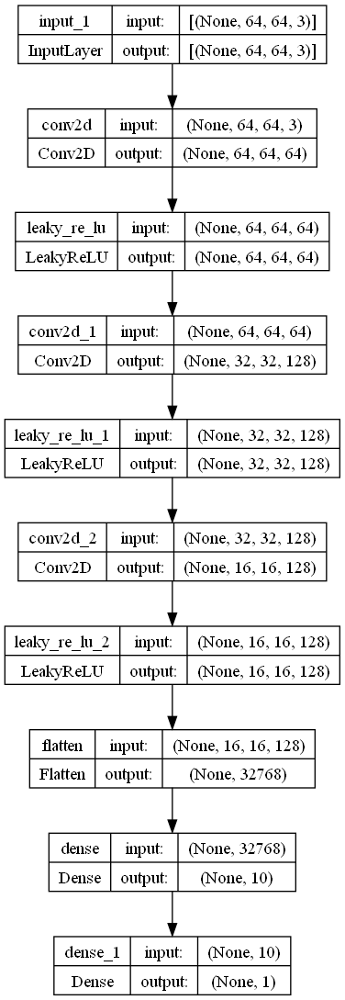

# Micro GAN (Generative Adversarial Network)

## Generative Adversarial Networks

Generative Adversarial Network or GAN for short is a deep-learning based training architecture. It consists of 2 models (neural networks) acting as each other's adversaries that optimize each other during the training process. This architecture is responsible for most of your favourite text-to-image and image generation models like Midjourney.

## Micro GAN

Models like Midjourney, Stable Diffusion, Imagegen are highly sophisticated. They are trained on millions of images with billions of parameters. This repo showcases, a very minimal and simple example of a GAN that generates image based on the images it is trained on.

For the sake of simplicity, it generates a 64x64 pixel image. This can be changed by altering the models based on the size of image you wish to generate.

## Components

A generic GAN consists of 2 parts. 
1. A **Generator** that generates the images.
2. A **Discriminator** that differentiates between a real image and generated image  

### Generator

The architecture of the Generator model looks something like this:

### Discriminator

The architecture of the Discriminator model looks something like this:

### Dataset

For training this model, I used the Abstract art dataset from Kaggle.
Link to dataset: [https://www.kaggle.com/datasets/bryanb/abstract-art-gallery](https://www.kaggle.com/datasets/bryanb/abstract-art-gallery)